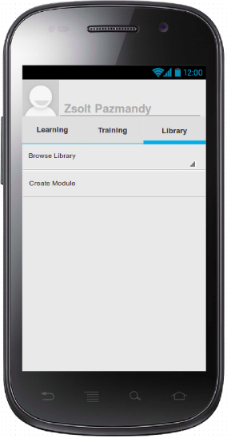
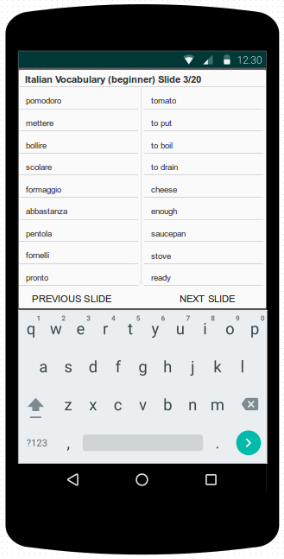
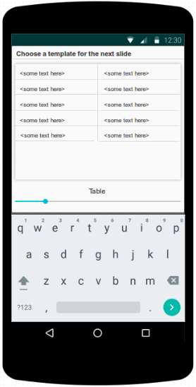
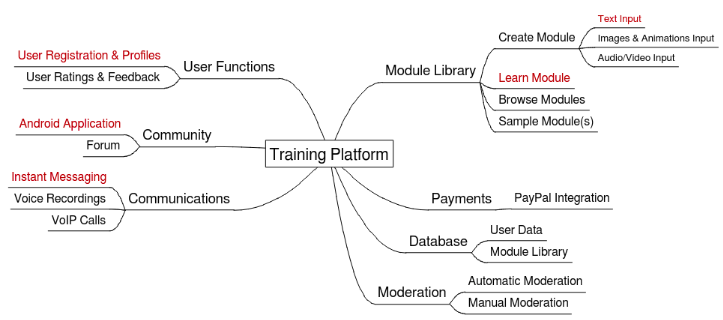
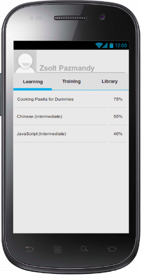
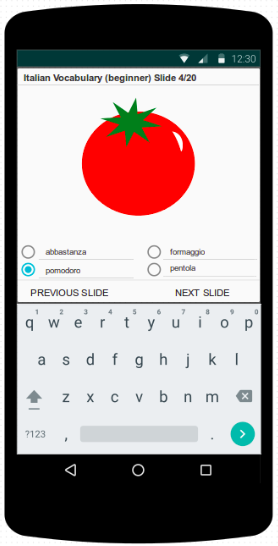

# tutor.me

A community-based, extensible tutoring platform for Android.

# Project Proposal

`Zsolt Pazmandy [ID: 1600690] MSc Computer Science Summer Project 2016`

## Introduction

The project aims to create a learning platform that links inquisitive individuals wishing to learn something with capable trainers ready to help them. It is an easy-to-use mobile application with a continuously growing, extensible, community-maintained library of subjects to laren. The purpose of the project is not to design specific curricula or to force a certain methodology on its users. Rather, it is a means of creating and delivering any learning material the community finds worthy of teaching. For the trainers of the community, it is a tutoring tool; for its learners it is a source of knowledge and access to people who other than being proficient in certain subjects, often have invaluable practical experience, too. 

## Definitions

### User

Any user of the service. All users are either 'Trainers' and/or 'Learners'. Users register for free using their email addresses and/or Facebook accounts. During the registration users may mark existing modules (Amateur or Pro) they would be willing to train others in by claiming proficiency in the relevant field. This claim is never centrally verified in any way. Learners express their satisfaction with the performance of their Trainers by rating them. Low ratings will eventually result in the loss of trust of the community, as no Learner would likely choose to be trained by someone who has been rated inadequate by others.

##### User Profiles

Basic user information (such as name, age, nationality, geographic location, fields of study) are shown and are visible to everyone on users' profiles. Additionally average rating and a collection of the most recent feedback from other users is displayed on every user's profile.

No personal credit card information of any kind is stored anywhere within the system. Payments are planned to be completed using PayPal direct debit payments, the implementation of which, however, is beyond the scope of the current project. 

##### Trainer

Any user training other users: Trainers are paid by Learners for tutoring them in a Pro module. For Trainers, the platform is a tool that enables them to earn money and the recognition of the community. Any user creating a module will automatically become its Trainer, however, other users can also decide to become Trainers of modules they did not create. A Trainer primarily uses the platform to deliver their learning content and provide relevant tutoring to their Learners. Trainers of a module may also be Learners of other modules at the same time.

##### Learner

Any user learning any module (Amateur or Pro) on the platform. Learners may take up any number of Amateur modules free of charge. Learners must pay Trainers for their tutoring given in Pro modules. Although Learners hold fewer responsibilities in the community than Trainers (since they are paying customers), their community rating and feedback is recorded. This is so, in order to ensure their respect of community rules and disciplined participation in the learning process. Since all people have different capabilities, and no prerequisite study of any kind may be taken for granted before a Learner starts a module, no Learner may ever be subjected to being rated based on their learning performance.

### Module

A single unit of a material to be learnt. The scope of a module is defined by the author and is dependent on the type of material (e.g. a language module may consist of the elicitation, explanation and practice of one or several verb tenses, or a module may consist of 100 pieces of vocabulary). All modules are designed by users who are proficient in the relevant field, this proficiency, however, is not verified in any way. The author of a module automatically becomes its first Trainer. Future Trainers may also offer tutoring in the same module, in which case Learners may choose their Trainer by comparing the information found on their user profiles (e.g. availability or rating). However, in order to incentivize Trainers' future authoring activities, Learners' choice of Trainer always defaults to the author of a module (its first Trainer). This is to ensure that a Trainer is rewarded by receiving the most payments if their authored module was acknowledged by the community, further fostering the Trainer's success.

##### Amateur Module

An Amateur module can be taken up by anyone, its author is automatically listed as its Trainer. Any module created initially belongs to this category. It is up to the community to decide whether an Amateur module is worth paying for. Once a [to be determined] amount of Learners have completed the course and have rated the module positively, the module becomes certified i.e. becomes a Pro module. As the Trainer receives no money for tutoring the Learner of an Amateur (i.e. brand new) module, its Trainer will aim to provide the best tutoring service and potentially modify the module to incorporate any constructive criticism from the Learner(s) in order to attract positive ratings from the community, thus ensuring that it would eventually become a Pro module, for which the Trainer would also be paid for.

##### Pro Module

When a Learner takes up a Pro module they choose a Trainer from all the available Trainers offering tutoring in that particular module. By choosing a Trainer, the Learner agrees to pay the Trainer. Authors of modules are automatically listed as Trainers of Pro modules, but any other user may also sign up to be a Trainer of a module. If there is more than one available Trainer to a specific module, the Learner may choose which Trainer they wish to be tutored by based on the Trainers' availabilities, experience in training the module or their overall rating. Trainers of Pro modules offer tutoring to Learners by answering their questions, explaining all or parts of the module using an instant messaging system and/or by using recorded voice messages.

##### Creating Modules

Any registered user may author learning modules and have them stored and readily available in the Module Library for other users to find and learn from. The application is intended to provide as much freedom to its trainers in compiling their learning modules as possible. Therefore, several of the most common teaching material design patterns are available for the trainers to choose from. However, for the scope of the current project the creation of modules is limited to text input only. The user may choose from several templates (eg. tables, fill-in-the-gaps, multiple-choice questions etc) to present the learning material. This is to be extended in the future with the possibility of including other media e.g. images, animations, audio and video.

### Training

Trainers are expected to help Learners dependently of the module in question either if they run into any difficulties understanding the material or perhaps Learners need to be guided through the material step-by-step. The platform is not intended to restrict or regulate how the community interacts - it is the community itself that will determine design its learning modules, and thus how much work is required from Trainers. Module descriptions will provide a clear summary of the module content and the amount and type of work required for its completion. Trainers will be rated for their input, and so will Learners - if any user fails to provide adequate tutoring, or respect the rules of the community and/or accept the requirements of a certain learning module, this will reflect in the feedback and rating of the collaborating user. This is the means by which the community is able to regulate and improve its composition: by valuing users' interaction and patience, and praising hard-working contributors by advertising their skills and competence. 

As an addition to Trainers designing and compiling the learning materials, they also help their Learners in any way they require. This may mean answering to their questions they might have during the completion of the learning module and/or with any relevant exercise, but it is not limited to answering questions. Some modules will require the Trainer's active involvement in the learning process: e.g. in a language learning module the Trainer (likely native speaker of the Learner's target language) would need to provide additional support (i.e. pronunciation of words, audio conversation etc.).

### Rating

All users (Learners and Trainers alike) rate each other based on their performance during or after they collaborated on a module. The rating system ensures that users' track record is visible to all future collaborators. As Learners choose their Trainers based on the Trainer's availability, proficiency, or ratings record, it is crucial for any Trainer to aim to maintain a generally positive rating overall. Likewise, Learners' input, willingness and respect of the general guidelines of the community will be rated by their respective Trainers, which may eventually negatively affect their perception within the community.

Any collaboration on a module is concluded by the mutual rating of those involved: Learners rate & provide feedback on their Trainer's performance and vice versa. All user profiles display the latest feedback and ratings activity pertaining to the user in order to give a better understanding of what to expect from an unknown member of the community before accepting to work together. Ratings data and feedback stay on record as long as the user's account exists.

## Development Plan & Expectations

The current paper intends to introduce the general idea of the project along with a list of prioritised critical objectives. The project will primarily focus on these components of the system and will conclude by presenting a list of proposed future extensions. The project is expected to complete the design and implementation of the core functions and logic of the system, and make space for the incorporation of a number of important extensions in the future. The following core elements below have been identified as those without which the fundamental functionality of the platform would not be achievable. The lack of any one of these would mean that the project fails to provide the services it seeks to.

### Core elements

##### 1. User registration & profiles
Users must be able to register in order for the system to be able to store their personal information and learning data. The development of corresponding classes and functions, therefore, is of the highest priority. Upon launching the application, users are presented with the options to register using using their email addresses or Facebook accounts, or to login using existing account details.

##### 2. Creating & publishing learning material
Users must be able to create their own modules in the public Module Library. The user community, and user involvement in designing the learning material are key defining factors that lead to the success of the system. The platform's modular quality is key to its versatility, and is therefore a high priority element on the list of core elements to implement.

##### 3. Choosing & delivering learning material
Users must be able to take up and learn any module they can find in the Module Library. Module content must be made readily and easily accessible in order to ensure core functionality of the platform, i.e. to allow users to learn from other members of the community.

##### 4. Instant messaging (IM)
Users must be able to initiate communication with other members of the community, therefore, the instant messaging service must be implemented within the system from the beginning. Learners must be able to request help from their Trainers and receive tutoring real-time, using email to maintain support between users would be far less efficient in providing support to Learners. 

##### 5. Android Application
Users must be able to access their profiles, learning material, and communications channels which connect them with the rest of the community (whether the user is a Trainer or a Learner) in order to maintain an seamless and efficient service. The development of the application and the integration of the first 4 core logic elements are the final step of the development of the core functions of the platform.

### Schedule

| # 	| Component 		| Duration 	| Start date		| Finish date 		|
| - 	| -					| -		 	| -					| -			 		|
|  1. 	| User Functions 	| 2 days 	| to be determined 	| to be determined 	|
| 1.1.	| Testing 			| 1 day 	| to be determined 	| to be determined 	|
|  2. 	| Create Module 	| 7 days 	| to be determined 	| to be determined 	|
| 2.1.	| Testing 			| 1 day 	| to be determined 	| to be determined 	|
|  3. 	| Learn Module 		| 7 days 	| to be determined 	| to be determined 	|
| 3.1.	| Testing 			| 1 day 	| to be determined 	| to be determined 	|
|  4. 	| IM 				| 2 days 	| to be determined 	| to be determined 	|
| 4.1.	| Testing 			| 1 day 	| to be determined 	| to be determined 	|
|  5. 	| Android App 		| 7 days 	| to be determined 	| to be determined 	|
| 5.1.	| UI 				| 1 day 	| to be determined 	| to be determined 	|
| 5.2.	| Integration 		| 1-2 days 	| to be determined 	| to be determined 	|
| 5.3.	| Testing 			| 1 day 	| to be determined 	| to be determined 	|

### Future Extension

>1. Payments using PayPal direct debit
>2. User Rating & feedback
>3. Expand Functionalities within Module Creation (e.g. images, audio/video)

>4. Improved communications functionalities & technology (e.g. VoIP calls)
>5. Scalable & secure database for user data, chat-logs & Module Library content
>6. Community Forums
>7. Moderation Functions (automatic & manual)

## Requirements

### Functional Requirements

- The system must be able to store user credentials (email addresses & password hash/Facebook credentials).
- The system must be able to store all users' connections (collaboration history) with other users
- The system must be able to authenticate users upon login & allow them access to their profiles and learning material.
- The system must be able to store all user-created content (Modules & content material).
- Users must be able to browse and download all module content available in the Module Library.
- The system must be able to serve parallel connections with clients in order to ensure real-time communications (i.e. IM service).

### Non-functional Requirements

- The application shall be easy-to-use. It should take the average user with no special technical training or prior knowledge no more than 5-10 minutes to familiarise themselves with the functionalities of the platform. Documentation shall be made readily available and easy to access from anywhere within the application.

- The application shall be accessible to everyone. Text colour and displayed background colours, font sizes and font types should take into consideration all viewing profiles and allow users with reduced eyesight to view and read the content. Rendering the application text using the OpenDyslexia font family should be made optionally available to users.

- The system's server(s) should be able to maintain connections with 1000 clients at the same time (subject to further scaling depending on the size of the user community & usage patterns).

- The system shall provide accessible documentation that covers all 
functionalities of the application and the platform.

- The system's server(s) should be available more than 90% of the time between the hours 8:00 and 24:00.

- The system's average response time to serve clients should be less than 5-6 seconds.

- The system should be constructed in a modular design, and should aim to minimize coupling between modules. 

- The system's capacity requirements should be assessed and reviewed regularly in order to be able to anticipate and implement any changes necessary for the system to scale.